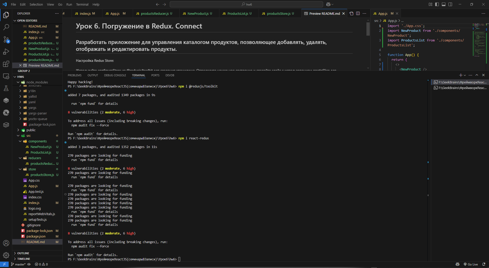
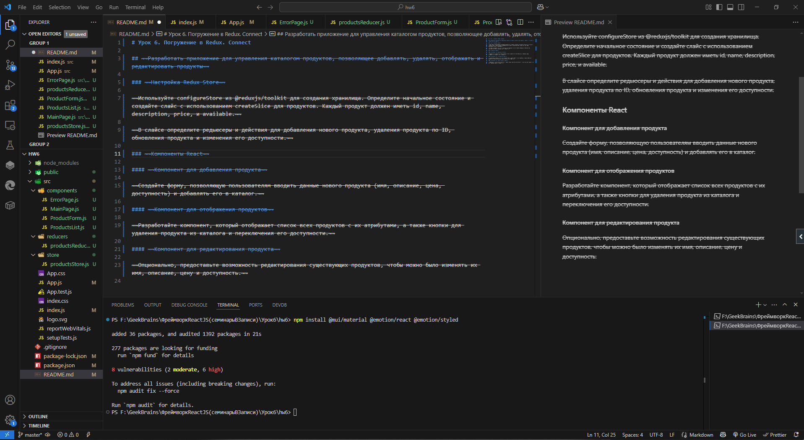
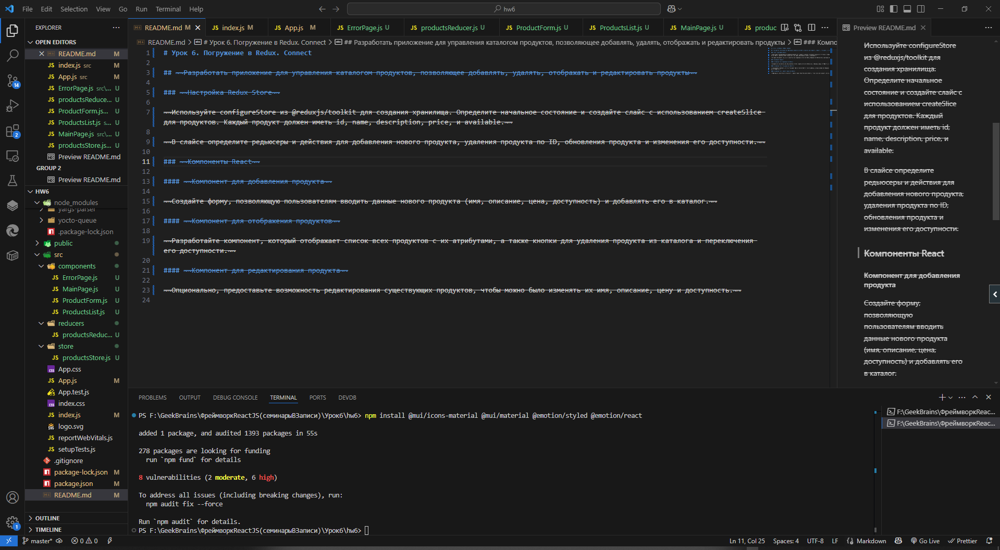
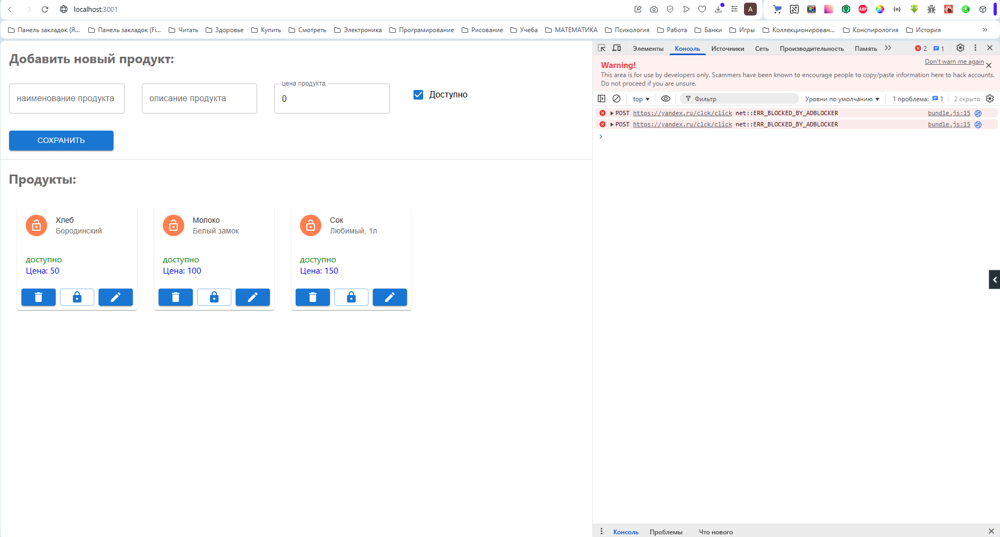
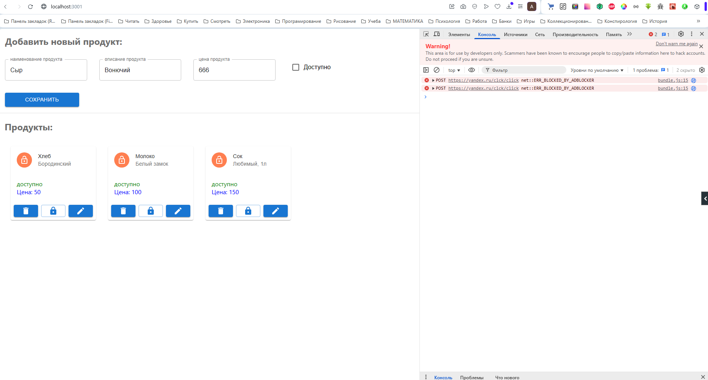
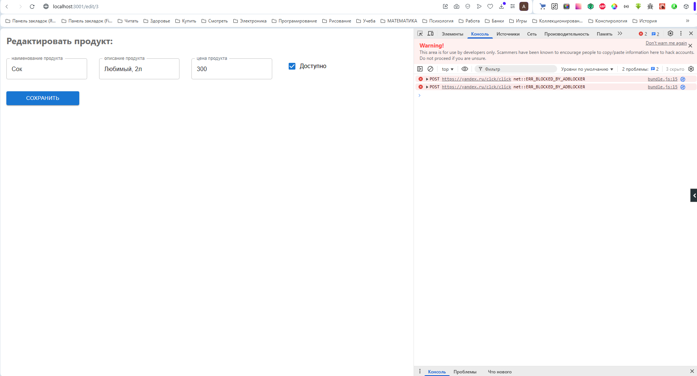
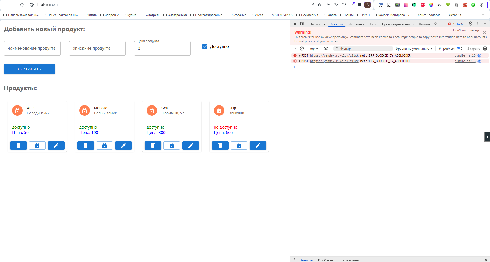

# Урок 6. Погружение в Redux. Connect






## Разработать приложение для управления каталогом продуктов, позволяющее добавлять, удалять, отображать и редактировать продукты

./src/index.js

```:js
import React from 'react';
import ReactDOM from 'react-dom/client';
import './index.css';
import App from './App';
import reportWebVitals from './reportWebVitals';
import { Provider } from 'react-redux';
import productStore from './store/productsStore';

const root = ReactDOM.createRoot(document.getElementById('root'));
root.render(
  <React.StrictMode>
    <Provider store={productStore}>
      <App />
    </Provider>
  </React.StrictMode>
);
```

./src/App.js

```:js
import { Route, BrowserRouter as Router, Routes } from 'react-router-dom';
import './App.css';
import MainPage from './components/MainPage';
import ProductForm from './components/ProductForm';
import ErrorPage from './components/ErrorPage';

function App() {
  return (
    <>
      <Router>
        <Routes>
          <Route path="/" element={<MainPage />} />
          <Route path="/edit/:productId" element={<ProductForm />} />
          <Route path="*" element={<ErrorPage />} />
        </Routes>
      </Router>
    </>
  );
}

export default App;
```

### Настройка Redux Store

Используйте configureStore из @reduxjs/toolkit для создания хранилища. Определите начальное состояние и создайте слайс с использованием createSlice для продуктов. Каждый продукт должен иметь id, name, description, price, и available.

./src/store/productStore.js

```:js
import { configureStore } from "@reduxjs/toolkit";
import { productReducer } from "../reducers/productsReducer";

const productStore = configureStore({
    reducer: productReducer
});

export default productStore;
```

В слайсе определите редьюсеры и действия для добавления нового продукта, удаления продукта по ID, обновления продукта и изменения его доступности.

.src/reducers/productsReducer.js

```:js
const { createSlice } = require("@reduxjs/toolkit");

const productsSlice = createSlice({
    name: "products",
    initialState: {
        products: [
            {
                id: 1,
                name: "Хлеб",
                description: "Бородинский",
                price: 50,
                available: true,
            },
            {
                id: 2,
                name: "Молоко",
                description: "Белый замок",
                price: 100,
                available: true,
            },
            {
                id: 3,
                name: "Сок",
                description: "Любимый, 1л",
                price: 150,
                available: true,
            },
        ],
    },
    reducers: {
        addProduct: (state, action) => {
            if (state.products.some(product =>
                        action.payload.name === product.name &&
                        action.payload.description === product.description &&
                        action.payload.price === product.price
                )
            ) return;
            state.products.push(action.payload);
        },
        deleteProduct: (state, action) => {
            state.products = state.products.filter(product => product.id !== action.payload);
        },
        updateProduct: (state, action) => {
            state.products = state.products.map(product => product.id === action.payload.id ? action.payload : product);
        },
        changeAvailabilityProduct: (state, action) => {
            state.products = state.products.map(product => product.id === action.payload ? { ...product, available: !product.available }: product);
        },
    },
});

export const {addProduct, deleteProduct, updateProduct, changeAvailabilityProduct} = productsSlice.actions;

export const productReducer = productsSlice.reducer;
```

### Компоненты React

#### Компонент для добавления продукта

Создайте форму, позволяющую пользователям вводить данные нового продукта (имя, описание, цена, доступность) и добавлять его в каталог.

./src/components/ProductForm.js

```:js
// Компонент для ввода нового и редактирования существующего продуктов

import React from 'react';
import { useState } from "react";
import { useDispatch, useSelector } from "react-redux";
import { addProduct, updateProduct } from "../reducers/productsReducer";
import { useNavigate, useParams } from 'react-router-dom';
import { Box, Button, Checkbox, FormControlLabel, TextField } from '@mui/material';


export default function ProductForm() {

    const dispatch = useDispatch();
    const products = useSelector(state => state.products);

    // Для программного перехода на маршрут '/' после сохранения или редактирования продукта
    const navigate = useNavigate();
    const navigateToRoot = () => {navigate('/')};

    const {productId} = useParams();

    // Если продукт новый или уже существующий
    let product = undefined;
    if (productId) product = products.find(product => product.id === parseInt(productId));

    const [name, setName] = useState(product ? product.name : '');
    const handleSetName = e => setName(e.target.value);

    const [description, setDescription] = useState(product ? product.description : '');
    const handleSetDescription = e => setDescription(e.target.value);

    const [price, setPrice] = useState(product ? product.price : 0);
    const handleSetPrice = e => setPrice(e.target.value);

    const [availability, setAvailability] = useState(product? product.available : true);
    const handleSetAvailability = e => setAvailability(!availability);

    const handleProduct = e => {
        // Не задано имя или описание или цена, тогда выходим
        if (!name || !description || !price) return;

        const processedProduct = {
                id: product ? product.id: products.length > 0 ? products[products.length - 1].id + 1 : 1,
                name: name,
                description: description,
                price: price,
                available: availability
        };

        // Редактируется существующий продукт
        if (product) {
            dispatch(updateProduct(processedProduct));
            // Для программного перехода на маршрут '/' после редактирования продукта
            navigateToRoot();
        }
        // Создается новый продукт
        else {
            dispatch(addProduct(processedProduct));
        };

        setName('');
        setDescription('');
        setPrice(0);
        setAvailability(true);
    };

    return (
        <Box component='section' sx={{ '& > :not(style)': { m: 2, width: '25ch' } }}>
            <h2 style={{color: 'GrayText'}}>{product ? 'Редактировать продукт:' : 'Добавить новый продукт:'}</h2>
            <TextField label='наименование продукта' variant='outlined' value={name} onChange={handleSetName} />
            <TextField label='описание продукта' variant='outlined' value={description} onChange={handleSetDescription} />
            <TextField type='number' label='цена продукта' variant='outlined' value={price} onChange={handleSetPrice} />
            <FormControlLabel control={<Checkbox checked={availability} onChange={handleSetAvailability} />} label='Доступно' />
            <Button variant='contained' onClick={handleProduct}>Сохранить</Button>
        </Box>
    );
};
```

#### Компонент для отображения продуктов

Разработайте компонент, который отображает список всех продуктов с их атрибутами, а также кнопки для удаления продукта из каталога и переключения его доступности.

./src/components/ProductsList.js

```:js
import React from 'react'; //
import { useDispatch, useSelector } from "react-redux";
import { changeAvailabilityProduct, deleteProduct } from "../reducers/productsReducer";
import { Link } from 'react-router-dom';
import { Avatar, Box, Button, Card, CardActions, CardContent, CardHeader } from '@mui/material';

// Иконки
import LockIcon from '@mui/icons-material/Lock';
import EditIcon from '@mui/icons-material/Edit';
import DeleteIcon from '@mui/icons-material/Delete';
import LockOpenIcon from '@mui/icons-material/LockOpen';

export default function ProductsList() {

    const dispatch = useDispatch();
    const products = useSelector(state => state.products);

    return (
        <Box component='section' style={{margin: 15}}>
            <h2 style={{color: 'GrayText'}}>Продукты:</h2>
            <Box sx={{display: 'flex', flexWrap: 'wrap'}}>
                {products.map(product => (
                    <Card key={product.id} sx={{ maxWidth: 345, margin: 2}}>

                        <CardHeader
                            avatar={<Avatar sx={{ bgcolor: 'coral' }}>{product.available ? <LockOpenIcon /> : <LockIcon />}</Avatar>}
                            title={product.name}
                            subheader={product.description}
                        />

                        <CardContent>
                            <span style={{color: product.available ? 'green' : 'red'}}>{product.available ? 'доступно' : 'не доступно'}</span>
                            <br/>
                            <span style={{color: 'blue'}}>Цена: {product.price}</span>
                        </CardContent>

                        <CardActions>
                            <Button variant='contained' onClick={e => dispatch(deleteProduct(product.id))} size='small'>
                                <DeleteIcon />
                            </Button>
                            <Button variant='outlined'  onClick={e => dispatch(changeAvailabilityProduct(product.id))} size='small'>
                                <LockIcon />
                            </Button>
                            <Link to={`/edit/${product.id}`}>
                                <Button variant='contained' size='small'>
                                    <EditIcon />
                                </Button>
                            </Link>

                        </CardActions>

                    </Card>
                ))}
            </Box>
        </Box>
    );
};
```

./src/components/MainPage.js

```:js
import React from 'react';
import ProductForm from "./ProductForm";
import ProductsList from "./ProductsList";
import { Divider } from '@mui/material';

export default function MainPage() {
    return (
        <div>
            <ProductForm />
            <Divider />
            <ProductsList />
        </div>
    );
};
```

./src/components/ErrorPage.js

```:js
export default function ErrorPage() {

    return (
        <h2>Ошибка</h2>
    );
};
```

#### Компонент для редактирования продукта

Опционально, предоставьте возможность редактирования существующих продуктов, чтобы можно было изменять их имя, описание, цену и доступность.

Компонент реализован в файле ./src/components/ProductList.js ...

## Примеры






